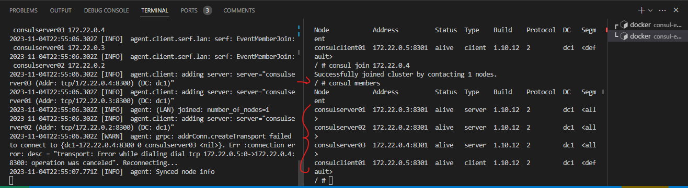
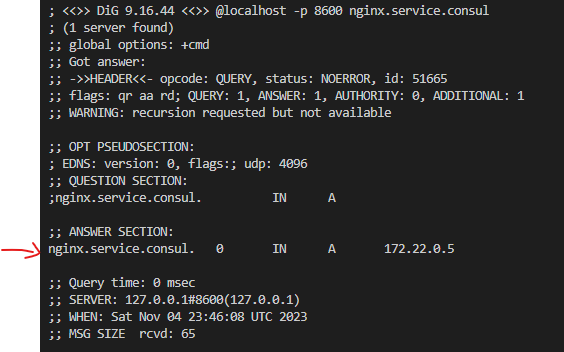

# CONSUL-ESSAY
A repository for study purposes: an essay using consul to show some of its capabilities.

# PART 1: generating a cluster with 3 servers

## Procedure to create a Cluster containing 3 servers.

### Command to generate the server (expecting to be joined to other N-1 servers) inside the consul number0X container using its inet address (xxx.xx.x.x)
`$ consul agent -server -bootstrap-expect=N -node=consulserver02 -bind=xxx.xx.x.x -data-dir=/var/lib/consul -config-dir=/etc/consul.d`

#### Inside the container where the server was generated you must to join it to the other servers using their respective inet address (xxx.xx.x.x)
`$ consul join xxx.xx.x.x`

### Run the command below to check which members belong to the cluster
`$ consul members`
The output will show which servers are recognized as part of the just generated cluster.

# PART 2: generating a client with 3 servers
The idea is to make this client register our server onto it.

## Procedure to create a Client inside the container where the client agent is
`$ consul agent -bind=xxx.xx.x.x -data-dir=/var/lib/consul -config-dir=/etc/consul.d`
where xxx.xx.x.x is the container inet address.

The trick here is to know that it will recognize you want to creat e client even you pass the "- server" argument or nothing, i.e., `$ consul agent`.

You'll note from the output that, thanks to Consul's "gossip protocol", your Client agent will warn you about not finding any running server.

### After that, you need to join that Client you just created to your previous generated cluster
Inside the Client container, run:
`$ consul join xxx.xx.x.x`
where xxx.xx.x.x is any of the cluster's 3 server's inet address.

To check, run 
`$ consul members`
then you'll see the consul client and the 3 servers connected to your unique node.

# PART 13: registering a service

## Procedure to register then upload a service.
First we register a service, then we upload it. These are two different and independent things. It's important to upload an agent onto the same machine where your service is running.

After create your services.json, you run `$ consul reload` inside the Consul Client container. That's going to reload the trigger and the client agent will notice a new service is synced.

## How to check my servers can see the just created Nginx service?
install Dig inside the Consul Client container running this command inside it:
`$ apk -U add bind-tools`

After installation, run:
`$ dig @localhost -p 8600 SRV`
You'll see it cannont find this generic service, but when you run
`$ dig @localhost -p 8600 nginx.service.consul`
You'll see it found the nginx consul server

To check from some of your servers (from the previous created cluster), you can run the following command inside some consul server container:
`$ dig @localhost -p 8600 nginx.service.consul` (do not forget to install Dig before it).

Does not matter in which machine you run that, if you did everything correct, you'll see the same output.

Equally, if a register a second service and upload it, it will identify 2 services IPs.

### We can search the services from our consul catalog
Inside the Consul Client container, you run:
`$ curl localhost:8500/v1/catalog/services` or `$ consul catalog nodes -service nginx` or `$ consul catalog nodes -detailed`
Check https://developer.hashicorp.com/consul/api-docs/catalog

The output will be for example `{"consul":[],"nginx":["web"]}`.

