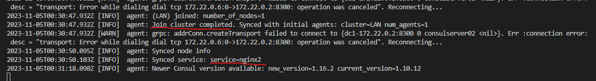
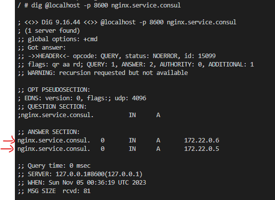
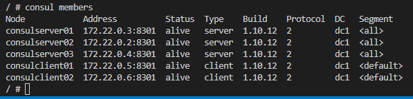
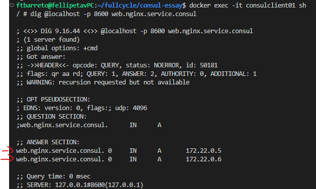
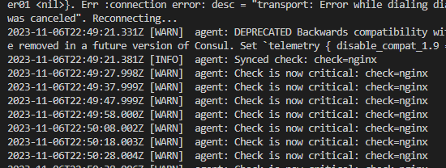
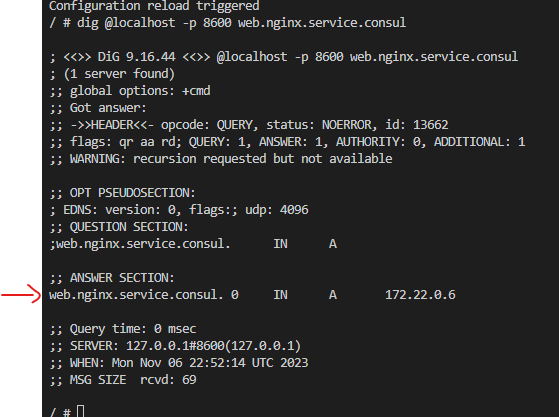
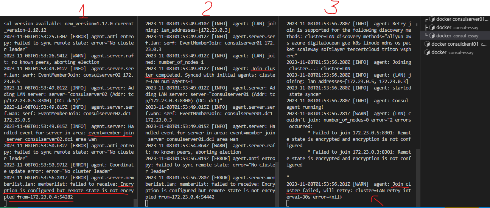
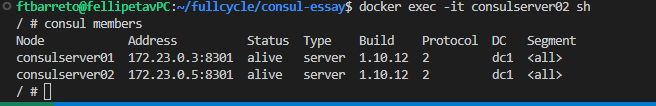
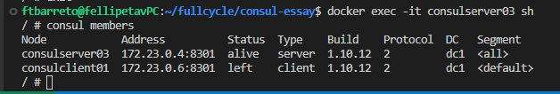
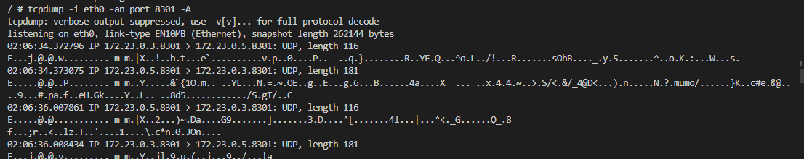

# CONSUL-ESSAY
A repository for study purposes: an essay using consul to show some of its capabilities.

# PART 1: generating a cluster with 3 servers

## Procedure to create a Cluster containing 3 servers.

### Command to generate the server (expecting to be joined to other N-1 servers) inside the consul number0X's container using its inet address (xxx.xx.x.x)
`$ consul agent -server -bootstrap-expect=N -node=consulserver02 -bind=xxx.xx.x.x -data-dir=/var/lib/consul -config-dir=/etc/consul.d`
You need to run `$ ifconfig` to obtain the inet address inside the desired container.

#### Inside the container where the server was generated you must to join it to the other servers using their respective inet address (xxx.xx.x.x)
`$ consul join xxx.xx.x.x`

### Run the command below to check which members belong to the cluster
`$ consul members`
The output will show which servers are recognized as part of the just generated cluster.

# PART 2: generating a client
The idea is to make this client register our server onto it.

## Procedure to create a Client inside the container where the client agent is
Firstly create the path to /var/lib/consul
`$  mkdir /var/lib/consul`
Then run:
`$ consul agent -bind=xxx.xx.x.x -data-dir=/var/lib/consul -config-dir=/etc/consul.d`
where xxx.xx.x.x is the container's inet address.

The trick here is to know that it will recognize you want to create a client either you pass the "- server" argument or nothing, i.e., `$ consul agent`.

You'll note from the output that, thanks to Consul's "gossip protocol", your Client agent will warn you about not finding any running server.

### After that, you need to join that Client you just created to your previous generated cluster
Inside the Client container, run:
`$ consul join xxx.xx.x.x`
where xxx.xx.x.x is any of the cluster's 3 server's inet address.

To check, run 
`$ consul members`
then you'll see the consul client and the 3 servers connected to your unique node.

# PART 3: registering a service

## Procedure to register then upload a service.
First we register a service, then we upload it. These are two different and independent things. It's important to upload an agent onto the same machine where your service is running.

After create your services.json, you run `$ consul reload` inside the Consul Client container. That's going to reload the trigger and the client agent will notice a new service is synced.

## How to check my servers can see the just created Nginx service?
install Dig inside the Consul Client container running this command inside it:
`$ apk -U add bind-tools`

After installation, run:
`$ dig @localhost -p 8600 SRV`
You'll see it cannont find this generic service, but when you run
`$ dig @localhost -p 8600 nginx.service.consul`
You'll see it found the nginx consul server

To check from some of your servers (from the previous created cluster), you can run the following command inside some consul server container:
`$ dig @localhost -p 8600 nginx.service.consul` (do not forget to install Dig before it).

Does not matter in which machine you run that, if you did everything correct, you'll see the same output.

Equally, if a register a second service and upload it, it will identify 2 services IPs.

### We can search the services from our consul catalog
Inside the Consul Client container, you run:
`$ curl localhost:8500/v1/catalog/services` or `$ consul catalog nodes -service nginx` or `$ consul catalog nodes -detailed`
Check https://developer.hashicorp.com/consul/api-docs/catalog

The output will be for example `{"consul":[],"nginx":["web"]}`.

# PART 4: registering a second service using retry join
The idea is registering a second service having the same name but obviously a differente id to demonstrate the Consul capability of identifying each service.

## Register the second service and upload it
Similarly to the previous part, we create another service.json inside another directory.

Then we run `$ docker-compose up -d` to generate the containers having the new Consul client agent (the "consulclient02") pointing to the volume where the second service is.

## Creating the client agent using some arguments to automate the subsequent join to the cluster
Firstly create the path to /var/lib/consul
`$  mkdir /var/lib/consul`
Then run:
`$ consul agent -bind=xxx.xx.x.x -data-dir=/var/lib/consul -config-dir=/etc/consul.d -retry-join=yyy.yy.y.y`
where xxx.xx.x.x and yyy.yy.y.y are respectively the client02 container's and any of your cluster's services' inet addresses.

After run that command, you'll see it could join the cluster and it will be synced to the "nginx2" id service.

## How to check if everything ran well
Inside the Consul Client 02's container, install Dig using the command already mentioned before (`$ apk -U add bind-tools`).

Then run: 
`$ dig @localhost -p 8600 nginx.service.consul`

We were capable of identifying each service.

## Partial conclusion
It's the idea of Service Discovery. The more Nginx machines scale they will join our Consul Cluster and we are capable of identifying each service by their respective DNSs. So as we can know we have N more machines available checking it periodically, then we can apply load balancing in the manner we want, for instance.
After we register our services, we can pass metadata (server information such as memory, cpu etc.).

Registered machines from a local search to the client:

Each client has all information the server has.

# PART 5: health check
The idea is trying the "Health check" Consul feature (see more at https://developer.hashicorp.com/consul/docs/services/configuration/checks-configuration-reference).

We're gonna add a Consul script check within the client which is responsible to registering the service 01.

Since we only have a health check script at service 01, if it has a bad response (e.g. out of service or critical), we'll not expect see it in our answer section after we run a Dig command.

## Procedure to add a check script within one of my services
Choose one of your services (e.g. "clients/consul01/services.json") and add a simple check script on it (get the script on Consul docs or see the commit related to this part).

## Testing the health check feature
Inside the container where your consulclient01 is, run `$ dig @localhost -p 8600 web.nginx.service.consul` to check the answer section.

Now, run `$ consul reload` to take the changes in "clients/consul01/services.json" into account.

Inside the container where you registered the consulclient01, you'll see the logs regarding the health check.

Since the check is warning the Nginx service is critical, we should not see this service available in the answer section after a second Dig comand.
So, go into a typeable terminal instance inside any agent container and run `$ dig @localhost -p 8600 web.nginx.service.consul`. You'll see only the other service is available:

# PART 6: Learning how to sync servers via files in the aim of automate the servers registering process

After create your "servers/server01/server.json" and change your "docker-compose.yaml", you need to kill your consulserver01 container and redeploy it (do not forget of building your container, since you changed your "docker-compose.yaml").

After deploy it, inside that container, run:
`$ consul agent -config-dir=/etc/consul.d` (it's going to read your "servers/server01/server.json" file and up your server following your defined settings).

# PART 7: Encrypting the connection between consul servers

The idea now is to demonstrate the Consul's capability of encrypting the connection between the consul servers. It can encrypt the Membership connection or via TLS by means of a certificate created by one of the clients/servers. We'll practice the second method.

## Procedure to create a certificate from some consulserver
You'll need a key/certificate to define an encryption key within your `server.json`.
Let's create a key from our consulserver01. To do that, run:
`$ consul keygen`

Now, all servers which have that key value defined within their respective `server.json` will be allowed to join the cluster and consequently only them will be capable of listen information from the clients/servers.

After that, try to restart your agents using `$ consul agent -config-dir=/etc/consul.d` (remember after Part 6, our command is shorter thanks to the automation via sync between server files).

After run that in all your 3 servers, you'll see the third one (the only one without the encryption key defined in its `server.json`) will fail the join.

If you run `$ consul members` inside the server 01 or 02's containers, you'll have:

If you do that insithe the server 03's container (the one without the encryption key), you'll have:

## Trying to listen to information via TCP eth0
Install tcpdump
`$ apk add tcpdump`

Inside the consulserver01, run `$ tcpdump -i eth0 -an port 8301 -A`.

See how everything is encrypted:

